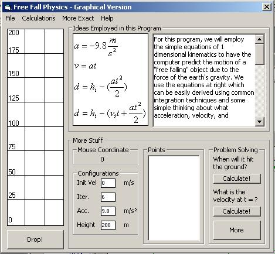



## Free Fall Physics

### Description

Free Fall Physics is intended to model free falling motion due to the earth's gravity.

This program acts as a grapher and calculator of problems pertaining to a free falling object. It outputs a visual "strobe-photograph" of a free falling object, and outputs points of the height.
 
### More Info
 
You must input accelerations (default is 9.8 m/s^2), an Initial Velocity (default is 0 m/s), the Initial Height (default is 200) to get outputs. Various other inputs are required for the problem solving or "calculations" form.

The user should definitely have some knowledge of introductory physics so he or she can understand where the equations come from.

This will return the values calculated (heights) or the values calculated with the given inputs to find the initial velocity, initial height, or the time it will hit the ground.

There are no known side effects or bugs. Please report them!!

             |
---                |---
**Submitted On**   |2003-10-28 17:33:00
**By**             |[JJ Geewax](https://github.com/Planet-Source-Code/PSCIndex/blob/master/ByAuthor/jj-geewax.md)
**Level**          |Intermediate
**User Rating**    |5.0 (20 globes from 4 users)
**Compatibility**  |VB 5\.0, VB 6\.0
**Category**       |[Math/ Dates](https://github.com/Planet-Source-Code/PSCIndex/blob/master/ByCategory/math-dates__1-37.md)
**World**          |[Visual Basic](https://github.com/Planet-Source-Code/PSCIndex/blob/master/ByWorld/visual-basic.md)
**Archive File**   |[Free\_Fall\_16643610282003\.zip](https://github.com/Planet-Source-Code/jj-geewax-free-fall-physics__1-49502/archive/master.zip)

